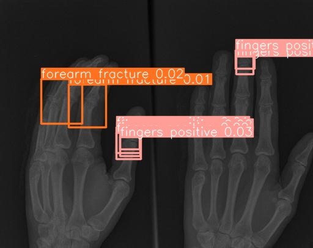
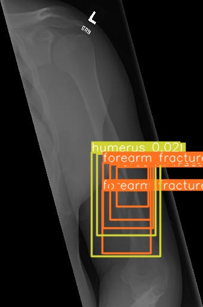

# fracture detection in human bons, using yolov8
all are steps to perform detection on custome dataset using YOLO V8 
i have written with redable comments, checkout the jupyter notebook.

### Demo image 1 

### Demo image 2

## Thank you 🙂